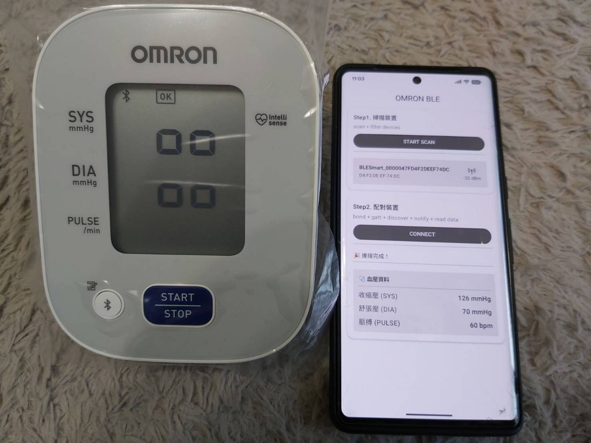
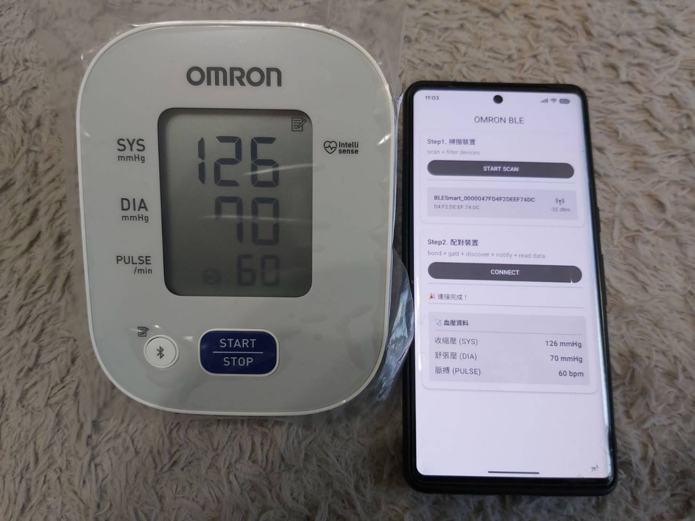

# OMRON BLE Compose（Blood Pressure Integration）

## 專案簡介

本專案是一個 **Android 原生 BLE（Bluetooth Low Energy）血壓機整合的工程級示範專案**，目標裝置為 **OMRON HEM‑7141T1**，完整展示從掃描、配對、GATT 連線，到血壓資料解析與 UI 呈現的 **可維運、可除錯、可擴充** 架構設計。

專案重點在於示範一套：

> **Presentation / Domain / Data / BLE Core** 職責清楚分離，並以 **Flow + 狀態機** 驅動 UI 的 BLE 實作方式。

---

## Demo

| Screenshot           |
|----------------------|
|  |
|  |

---

## 專案特色

* ✅ 完整 **BLE 連線狀態機**（Bond → Connect → Discover → Notify → Command → Ready）
* ✅ 使用 **Flow / StateFlow** 驅動 UI（Compose 無需直接碰 BLE API）
* ✅ Command / Notification / Parser **責任清楚切分**
* ✅ 支援 **C3 Indication** 即時接收血壓封包

---

## 專案架構

```
com.alex.yang.omronblecompose
│
├── App.kt
├── MainActivity.kt
│
├── di
│   └── BleModule.kt
│
├── presentation
│   ├── HomeScreen.kt
│   ├── HomeViewModel.kt
│   └── component
│       ├── ActionOneCard.kt   // Scan
│       ├── Action2Card.kt     // Connect
│       ├── Action3Card.kt     // Read Data
│       └── BloodPressureCard.kt
│
├── domain
│   ├── model
│   │   ├── ScanState.kt
│   │   ├── ConnectionState.kt
│   │   └── Device.kt
│   ├── repository
│   │   └── BleRepository.kt
│   └── usecase
│       └── ConnectUseCase.kt
│
└── data
    └── ble
        ├── repository
        │   └── BleRepositoryImpl.kt
        ├── scanner
        │   └── BleScannerImpl.kt
        ├── connector
        │   └── BleConnectorImpl.kt
        ├── core
        │   ├── BleException.kt
        │   ├── OmronCommands.kt
        │   └── OmronBloodPressureParser.kt
        └── OmronConfig.kt
```

---

## 架構設計原則

* **UI 不直接操作 BluetoothGatt**
* **ViewModel 只處理狀態，不處理 BLE 細節**
* **BLE Callback → Coroutine Continuation → Flow** 單向資料流
* **Domain State 是 UI 的唯一依據**

---

## 核心流程說明

### 1️⃣ 掃描裝置（Scan）

1. UI 觸發 `StartScan`
2. `BleScannerImpl` 使用 `callbackFlow` 啟動掃描
3. 發現裝置後 emit `ScanState.Found`
4. ViewModel 更新 UI

---

### 2️⃣ 配對與連線（Bond + GATT）

1. UI 觸發 `StartConnect`
2. `ConnectUseCase → BleRepository → BleConnector`
3. 流程：

    * createBond
    * awaitBond
    * connectGatt
    * discoverServices
    * enable CCCD（C3 / C1）

所有狀態以 `ConnectionState` 回傳給 UI。

---

### 3️⃣ 指令與資料讀取（Command / Indication）

執行指令順序：

1. `QUERY_DEVICE_STATUS`
2. `READ_BLOOD_PRESSURE`
3. `END_COMMUNICATION`

血壓資料透過 **C3 Indication** 回傳，並經由：

```
C3 Notification
   ↓
looksLikeOmronBp()
   ↓
OmronBloodPressureParser
   ↓
BloodPressureData State
```

---

## 血壓資料解析

* 僅接受 **20 bytes** 的血壓封包
* 解析 SYS / DIA / PULSE
* 過濾無效封包（0x80 / 0xFF）

---

## 錯誤處理設計

所有 BLE 失敗情境皆以 **型別化 Exception** 表示：

* BondFailed
* ConnectFailed
* DiscoverFailed
* Service / Characteristic / CCCD Not Found
* WriteCommandFailed

並統一轉換為：

```
ConnectionState.Error
```

---

## 未來擴充方向

* 🔹 取得最新一筆資料
* 🔹 多筆歷史血壓同步策略
* 🔹 背景 Service 自動同步
* 🔹 與官方 OMRON App 封包行為對照

---

## Author

**Alex Yang**
Senior Android Engineer
🌐 [https://github.com/m9939418](https://github.com/m9939418)

---

## ⭐ 如果這個專案對你有幫助，歡迎給個 Star

